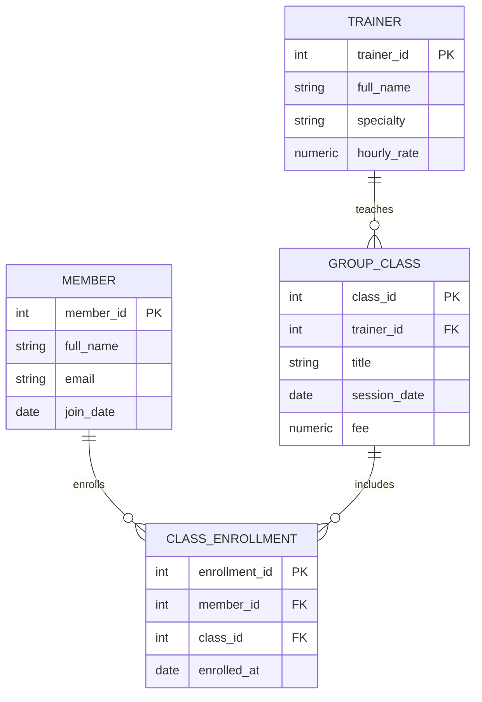

# ER Diyagramı — Spor Salonu ve Ders Kayıt Sistemi

```mermaid
erDiagram
    MEMBER ||--o{ CLASS_ENROLLMENT : "enrolls"
    GROUP_CLASS ||--o{ CLASS_ENROLLMENT : "includes"
    TRAINER ||--o{ GROUP_CLASS : "teaches"

    MEMBER {
        int member_id PK
        string full_name
        string email
        date join_date
    }

    TRAINER {
        int trainer_id PK
        string full_name
        string specialty
        numeric hourly_rate
    }

    GROUP_CLASS {
        int class_id PK
        int trainer_id FK
        string title
        date session_date
        numeric fee
    }

    CLASS_ENROLLMENT {
        int enrollment_id PK
        int member_id FK
        int class_id FK
        date enrolled_at
    }
```
